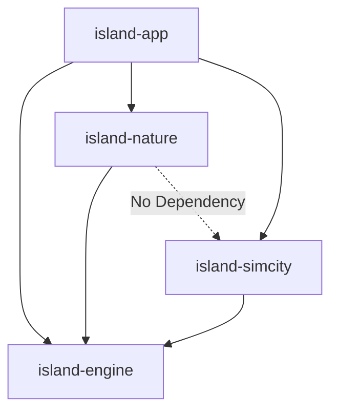

# Architecture Presentation: Island Ecosystem Simulator

## 1. High-Level Modular Design
The project is split into independent JPMS modules to ensure strict boundary control.



- **island-engine**: Domain-agnostic simulation core (ECS, GameLoop, SoA).
- **island-nature / island-simcity**: Domain plugins implementing specific logic.
- **island-app**: Spring Boot host for REST, WebSocket, and Persistence.

## 2. Core Engine Internals
The engine uses a **Phase-based Scheduler** to manage concurrent execution without race conditions.

```text
GameLoop.runTick()
  ├── Phase.PREPARE (Initialize tick data)
  ├── Phase.SIMULATION (Parallel System Execution)
  │     └── ParallelDispatcher (Virtual Threads)
  └── Phase.POSTPROCESS (Broadcast, Statistics, Persistence)
```

## 3. Data Flow: Tick to Browser
1. **Engine**: `GameLoop` completes a tick.
2. **Broadcast**: `TickBroadcastTask` takes a consistent `WorldSnapshot`.
3. **Transport**: `SimpMessagingTemplate` pushes snapshot via **WebSocket (STOMP)**.
4. **Client**: `useSimulationSocket` hook receives data and updates **Zustand store**.
5. **UI**: `WorldCanvas` re-renders only the changed areas.

## 4. Performance: SoA (Structure of Arrays)
Instead of a list of objects, data is stored in primitive arrays for CPU cache efficiency.

- **AoS (Traditional)**: `[ {x, y, health}, {x, y, health}, ... ]` -> High Cache Miss.
- **SoA (Engine)**: `x[], y[], health[]` -> 3x Throughput in benchmarks.

## 5. Quality Gate
- **ArchUnit**: Automated enforcement of layer boundaries.
- **jqwik**: Property-based testing for domain invariants.
- **PITest**: Mutation testing to ensure test suite effectiveness.
- **JMH**: Continuous performance tracking.
