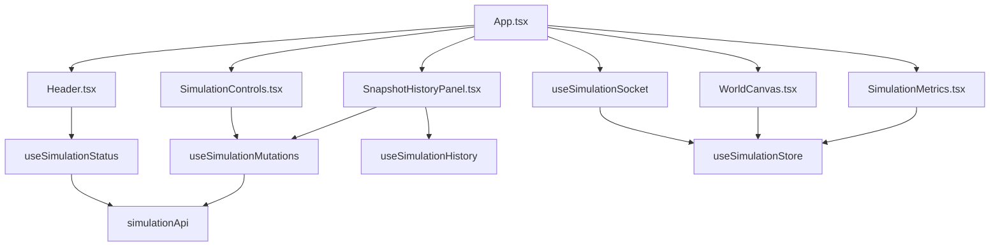

# Frontend UML: Island Ecosystem Simulator (v1.77.0)

## Component & State Architecture



### Pseudographic Class/Component Diagram

```text
+-----------------------+       +-------------------------+
|      App.tsx          |       |   useSimulationStore    |
+-----------------------+       +-------------------------+
| - selectedCoords      |------>| - snapshot: WorldSnap   |
| - showHistoryPanel    |       | - populationHistory     |
+-----------------------+       | - viewingHistory: bool  |
           |                    +-------------------------+
           |                                ^
           v                                |
+-----------------------+       +-------------------------+
|    useSimulationSocket|------>|   (updates store via    |
+-----------------------+       |    WebSocket events)    |
| - setupSTOMP()        |       +-------------------------+
+-----------------------+
           |
           v
+-----------------------+       +-------------------------+
|  useSimulationQueries |       |      simulationApi      |
+-----------------------+       +-------------------------+
| - useStatus()         |------>| - getStatus()           |
| - useHistory()        |       | - start/stop/pause()    |
| - useMutations()      |       | - save/loadSnapshot()   |
+-----------------------+       +-------------------------+

+-----------------------+       +-------------------------+
|      WorldCanvas      |       |    SimulationMetrics    |
+-----------------------+       +-------------------------+
| - ctx: CanvasRendering|       | - Recharts (LineChart)  |
| - zoom, pan state     |       | - Stats display         |
+-----------------------+       +-------------------------+
```

## Data Models (island-ui)

```text
+-------------------------+      +-------------------------+
|      WorldSnapshot      |      |      NodeSnapshot       |
+-------------------------+      +-------------------------+
| - tickCount: number     |      | - coordinates: string   |
| - width, height: number |<>----| - topSpeciesCode: string|
| - nodes: NodeSnap[][]   |      | - hasOrganisms: boolean |
+-------------------------+      +-------------------------+

+-------------------------+      +-------------------------+
|    PopulationPoint      |      |     SimulationStatus    |
+-------------------------+      +-------------------------+
| - tick: number          |      | enum:                   |
| - [species]: number     |      |   IDLE, RUNNING, PAUSED |
+-------------------------+      +-------------------------+
```
