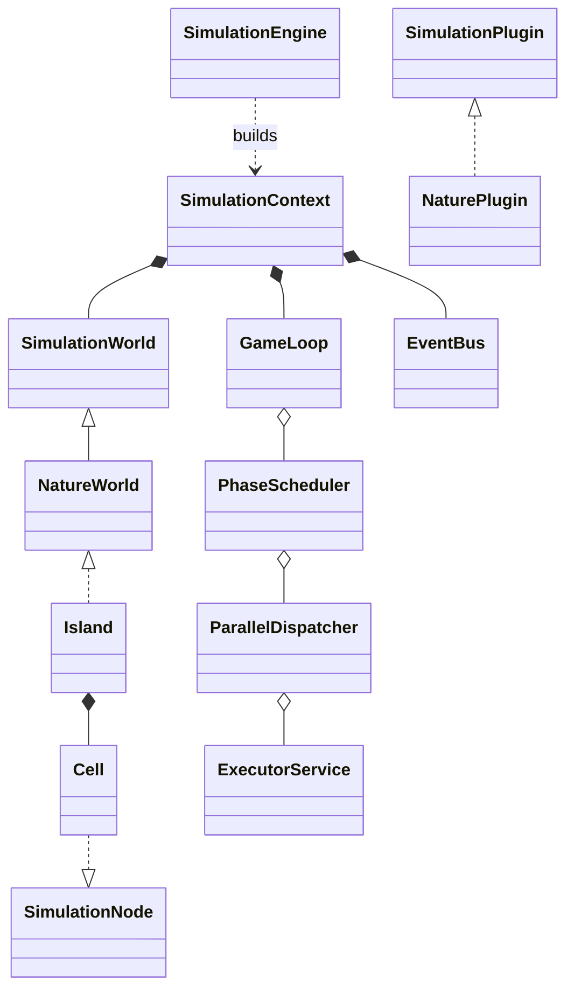

# UML: Island Ecosystem Simulator (v1.76.0)

## Engine Core Structure



### Pseudographic Class Diagram

```text
+----------------------------------+          +---------------------------+
|        SimulationEngine          |          |     SimulationPlugin<T>   |
+----------------------------------+          +---------------------------+
| + build(plugin, config): Context |<---------| + createWorld(EventBus)   |
| + start(plugin, config): Context |          | + registerTasks(...)      |
+----------------------------------+          | + onSimulationStarted()   |
                |                             +---------------------------+
                |                                           ^
                v                                           |
+----------------------------------+          +---------------------------+
|       SimulationContext<T>       |          |        NaturePlugin       |
+----------------------------------+          +---------------------------+
| - world: SimulationWorld<T>      |          | - config: Configuration   |
| - gameLoop: GameLoop<T>          |          | - domainContext: NatureDC |
| - eventBus: EventBus             |          +---------------------------+
| - executor: ExecutorService      |                        |
+----------------------------------+                        |
                |                                           |
                |                                           v
                v                             +---------------------------+
+----------------------------------+          |           Island          |
|       SimulationWorld<T>         |          +---------------------------+
+----------------------------------+          | - grid: Cell[][]          |
| + tick(tickCount)                |<---------| - chunks: List<Chunk>     |
| + createSnapshot(): Snapshot     |          | - registry: SpeciesReg.   |
| + getParallelWorkUnits(): Coll   |          +---------------------------+
+----------------------------------+                        |
                ^                                           |
                |                                           v
+----------------------------------+          +---------------------------+
|        SimulationNode<T>         |          |            Cell           |
+----------------------------------+          +---------------------------+
| + addEntity(entity): boolean     |<---------| - entities: EntityCont.   |
| + removeEntity(entity): boolean  |          | - x, y: int               |
+----------------------------------+          +---------------------------+
```

## Domain Model (island-nature)

```text
+----------------------+      1..*      +----------------------+
|        Island        |---------------->|         Cell         |
+----------------------+                +----------------------+
| - width, height      |                | - x, y               |
| - spatialIndex       |                | - terrain: Terrain   |
+----------------------+                +----------------------+
           |                                       |
           |                                       | 1
           |                                       v
           |                            +----------------------+
           |                            |   EntityContainer    |
           |                            +----------------------+
           |                            | - animals: List<A>   |
           |                            | - biomass: Map<S, B> |
           |                            +----------------------+
           |                                       |
           |           +---------------------------+
           |           |
           v           v
+----------------------------------+
|           Organism (T)           |
+----------------------------------+
| - id: long                       |
| - species: SpeciesKey            |
+----------------------------------+
    ^                    ^
    |                    |
+----------+       +-----------+
|  Animal  |       |  Biomass  |
+----------+       +-----------+
| - health |       | - amount  |
| - age    |       +-----------+
+----------+
```
